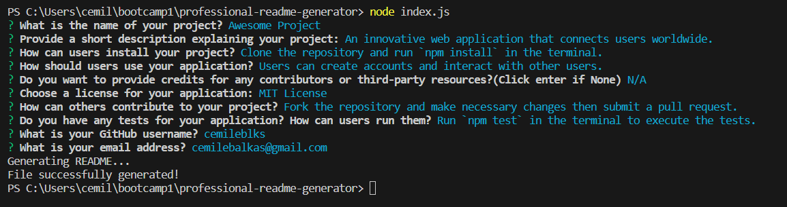

# Professional README Generator

## Description
A README generator that can quickly create a professional README for a new project!

## Table of Contents
- [Installation](#installation)
- [Usage](#usage)
- [Credits](#credits)
- [License](#license)

## Installation

To install, you first need to clone this repository to your local machine and then run `npm install` in the terminal to install the required dependencies for the project.

## Usage

To start using the application, run the command `node index.js`. This will prompt you with questions that will form the content of the generated README.md file. You can find the generated README.md in the `generated-files` folder.

**Walkthrough Video**

Watch a brief walkthrough video to see how the application works:

[Watch the video walkthrough](https://drive.google.com/file/d/12_ytohTRUcynRG0Yme0HVcneNv_dp8z1/view?usp=sharing).

**Screenshot**

Screenshot showcasing the application and its functionality:

**Example README**

Here is an example of the generated [README.md](/generated-files/README.md).

## Credits

The badges generated in this project are based on the licenses listed in [this gist](https://gist.github.com/lukas-h/2a5d00690736b4c3a7ba).

## License

This project is licensed under the MIT License.

